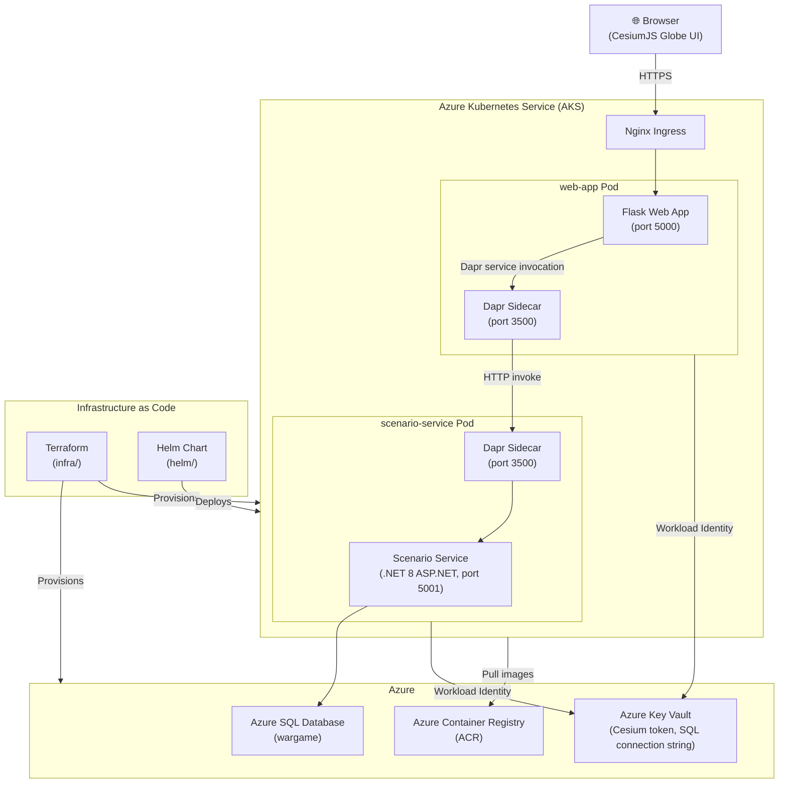

# War Game Visualizer

An application that supports crafting wargame scenarios and visualizing them playing out on an interactive 3D globe.

## Project Summary

War Game Visualizer is a cloud-native, microservices-based application that lets users define and simulate wargame scenarios on a CesiumJS 3D globe. Users can create scenarios with geographic bounding boxes, then watch them unfold on an interactive map powered by [CesiumJS](https://cesium.com/).

**Key capabilities:**
- **Scenario management** — Create, list, and view wargame scenarios via a REST API backed by a .NET microservice and Azure SQL.
- **3D globe visualization** — A Python/Flask web frontend renders scenarios using CesiumJS with a Cesium Ion token for terrain and imagery.
- **Event-driven messaging** — Services communicate via [Dapr](https://dapr.io/) pub/sub, enabling loose coupling and extensibility.
- **Cloud-native deployment** — Runs on Azure Kubernetes Service (AKS) with Helm, secured by Azure Key Vault (CSI driver + Workload Identity) and Azure Container Registry (ACR).
- **Infrastructure as Code** — All Azure resources are provisioned with Terraform.

---

## Repo File Structure

```
war-game-visualizer/
├── .devcontainer/
│   └── devcontainer.json          # VS Code dev container (Ubuntu 22.04, .NET 8, Python, kubectl, Helm, Azure CLI)
├── .vscode/
│   └── tasks.json                 # VS Code tasks that wrap the scripts below
├── helm/                          # Kubernetes Helm chart
│   ├── Chart.yaml                 # Chart metadata and Dapr sub-chart dependency
│   ├── values.yaml                # Default values (ACR, Key Vault, Workload Identity, resources)
│   └── templates/
│       ├── dapr-pubsub.yaml       # Dapr pub/sub component manifest
│       ├── deployment.yaml        # K8s Deployment with Dapr sidecar annotations
│       ├── ingress.yaml           # Nginx ingress resource
│       ├── secretproviderclass.yaml # Azure Key Vault CSI secret provider
│       ├── service.yaml           # K8s Service
│       └── serviceaccount.yaml   # Service account with Workload Identity federation
├── infra/                         # Terraform infrastructure-as-code
│   ├── main.tf                    # Azure resources: RG, AKS, ACR, SQL, Key Vault, identities
│   ├── outputs.tf                 # Terraform outputs (ACR server, client IDs, etc.)
│   ├── providers.tf               # Azure, AzureAD, and Random providers; remote tfstate backend
│   └── variables.tf               # Input variables (location, environment, node count, secrets)
├── protos/
│   └── scenario.proto             # Protobuf schema for the Scenario data model
├── scripts/
│   ├── build-and-push.sh         # Builds a service Docker image and pushes it to ACR
│   └── deploy-helm.sh            # Deploys the Helm chart to AKS via `helm upgrade --install`
├── services/
│   ├── base/
│   │   └── Dockerfile             # Shared .NET 8.0 base image (non-root user, ports 5001/3500/50001)
│   └── web-app/
│       ├── Dockerfile             # Python 3.12 slim image (non-root user, port 5000)
│       ├── app.py                 # Flask application — serves UI and proxies scenario CRUD via Dapr
│       ├── requirements.txt       # Python dependencies (Flask, Dapr SDK, Gunicorn, etc.)
│       └── templates/
│           └── index.html         # CesiumJS globe UI
├── LICENSE                        # MIT License
└── README.md                      # This file
```

---

## Architecture

The following diagram shows the runtime and infrastructure architecture of the application.



---

## Development Setup

The repository includes a [VS Code Dev Container](.devcontainer/devcontainer.json) that pre-installs all required tooling.

**Prerequisites:** [VS Code](https://code.visualstudio.com/) with the [Dev Containers extension](https://marketplace.visualstudio.com/items?itemName=ms-vscode-remote.remote-containers) and [Docker Desktop](https://www.docker.com/products/docker-desktop/).

1. Open the repository in VS Code.
2. When prompted, select **Reopen in Container** (or run **Dev Containers: Reopen in Container** from the command palette).
3. The container will build and install: .NET 8.0, Python dependencies, Azure CLI, kubectl, Helm, Minikube, and k9s.
4. Forwarded ports: `5000` (Flask), `5001` (ASP.NET), `3500` (Dapr).

---

## Deploying Infrastructure to Azure

All Azure resources are managed with Terraform in the [`infra/`](infra/) directory.

### Prerequisites

- [Azure CLI](https://learn.microsoft.com/en-us/cli/azure/install-azure-cli) installed and authenticated
- [Terraform](https://developer.hashicorp.com/terraform/install) ≥ 1.5
- An Azure subscription with Contributor + User Access Administrator permissions

### Steps

**1. Authenticate with Azure**

```bash
az login
az account set --subscription "<your-subscription-id>"
```

**2. Provision the Terraform state backend** (one-time setup)

The Terraform backend uses an Azure Storage Account. Create it before running `terraform init`:

```bash
# Storage account names must be globally unique — replace <unique-suffix> with a short identifier
az group create --name tfstate-rg --location eastus
az storage account create --name tfstatesa<unique-suffix> --resource-group tfstate-rg \
  --sku Standard_LRS --kind StorageV2
az storage container create --name tfstate --account-name tfstatesa<unique-suffix>
```

**3. Initialize Terraform**

```bash
cd infra/
terraform init
```

**4. Review the plan**

```bash
terraform plan \
  -var="sql_admin_password=<your-secure-password>" \
  -var="cesium_ion_token=<your-cesium-token>"
```

**5. Apply the infrastructure**

```bash
terraform apply \
  -var="sql_admin_password=<your-secure-password>" \
  -var="cesium_ion_token=<your-cesium-token>"
```

This provisions: Resource Group, AKS cluster (2× Standard_D2s_v3, Kubernetes 1.28), ACR, Azure SQL, Azure Key Vault, Managed Identities, and Workload Identity federation.

**6. Capture Terraform outputs**

After `apply` completes, export the outputs for use by the build and deploy scripts:

```bash
export ACR_LOGIN_SERVER=$(terraform output -raw acr_login_server)
export KEY_VAULT_NAME=$(terraform output -raw key_vault_name)
export KEY_VAULT_TENANT_ID=$(terraform output -raw key_vault_tenant_id)
export WORKLOAD_IDENTITY_CLIENT_ID=$(terraform output -raw workload_identity_client_id)
export AKS_NAME=$(terraform output -raw aks_name)
export RESOURCE_GROUP=$(terraform output -raw resource_group_name)
```

---

## Building and Pushing Docker Images

Use [`scripts/build-and-push.sh`](scripts/build-and-push.sh) to build a service image and push it to ACR.

### Prerequisites

- Docker daemon running
- Azure CLI authenticated (`az login`)
- `ACR_NAME` environment variable set (the registry name without `.azurecr.io`)

```bash
export ACR_NAME="wargamevisualizerdevacr"
```

### Usage

```bash
./scripts/build-and-push.sh <service-name> [image-tag]
```

### Examples

```bash
# Build and push the Flask web app with the 'latest' tag
./scripts/build-and-push.sh web-app latest

# Build and push with a specific version tag
./scripts/build-and-push.sh web-app v1.2.3

# Build and push the scenario service
./scripts/build-and-push.sh scenario-service latest
```

The script:
1. Logs in to ACR (`az acr login`)
2. Builds the Docker image using the service's `Dockerfile`, passing the shared base image as `BASE_IMAGE`
3. Pushes the image to `${ACR_NAME}.azurecr.io/${service-name}:${image-tag}`

---

## Deploying to AKS

Use [`scripts/deploy-helm.sh`](scripts/deploy-helm.sh) to deploy or upgrade the application on AKS.

### Prerequisites

- `kubectl` configured to target the AKS cluster
- Helm 3 installed
- Environment variables from Terraform outputs (see [Deploying Infrastructure](#deploying-infrastructure-to-azure))

### Get AKS credentials

```bash
az aks get-credentials \
  --resource-group "${RESOURCE_GROUP}" \
  --name "${AKS_NAME}"
```

### Usage

```bash
./scripts/deploy-helm.sh [--env <environment>] [--values <extra-values-file>] [--dry-run]
```

### Examples

```bash
# Deploy to the dev environment
./scripts/deploy-helm.sh --env dev

# Preview the deployment without applying changes
./scripts/deploy-helm.sh --env dev --dry-run

# Deploy with additional values overrides
./scripts/deploy-helm.sh --env dev --values ./helm/values.prod.yaml
```

The script:
1. Creates the `war-game-visualizer` namespace if it does not exist
2. Adds and updates the Dapr Helm repository
3. Builds Helm chart dependencies (Dapr sub-chart)
4. Runs `helm upgrade --install` with Workload Identity and Key Vault values injected

---

## VSCode Tasks

The [`.vscode/tasks.json`](.vscode/tasks.json) file provides VS Code tasks that wrap the scripts above. Run them via **Terminal → Run Task...** or the command palette (**Tasks: Run Task**).

| Task | Description |
|---|---|
| **Build: web-app** | Builds and pushes the `web-app` Docker image to ACR. Prompts for an image tag (default: `latest`). Requires `ACR_NAME` to be set. |
| **Build: scenario-service** | Builds and pushes the `scenario-service` Docker image to ACR. Prompts for an image tag (default: `latest`). Requires `ACR_NAME` to be set. |
| **Deploy: Helm (dev)** | Deploys the Helm chart to the `dev` environment on AKS. Requires `ACR_LOGIN_SERVER`, `KEY_VAULT_NAME`, `KEY_VAULT_TENANT_ID`, and `WORKLOAD_IDENTITY_CLIENT_ID` to be set. |
| **Deploy: Helm (dry-run)** | Runs a dry-run of the Helm deployment to preview changes without applying them. |
| **Terraform: Init** | Runs `terraform init` in the `infra/` directory. |
| **Terraform: Plan** | Runs `terraform plan` in the `infra/` directory (depends on **Terraform: Init**). |
| **Terraform: Apply** | Runs `terraform apply` in the `infra/` directory (depends on **Terraform: Plan**). |
